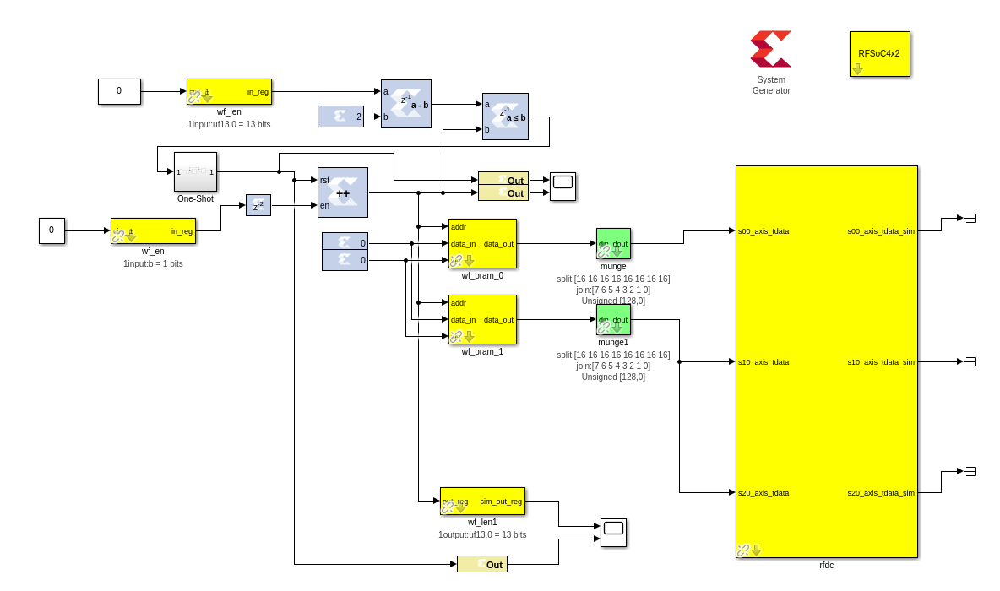
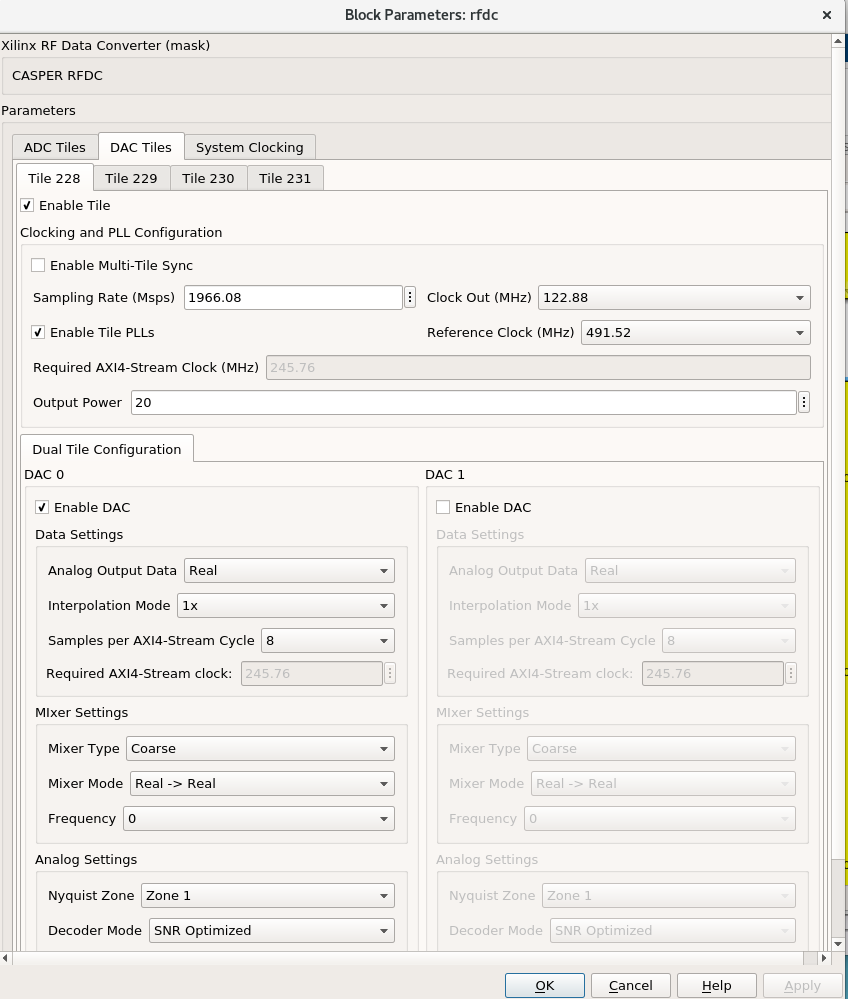
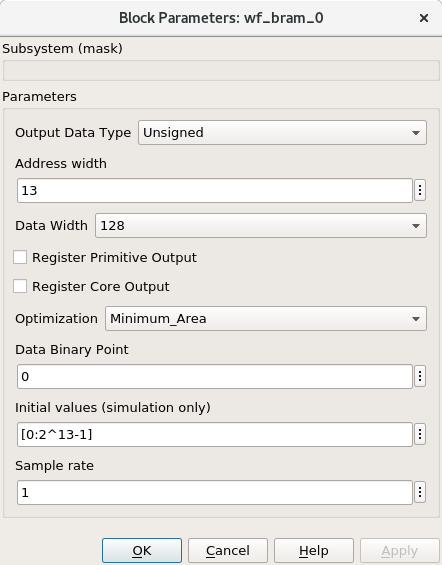
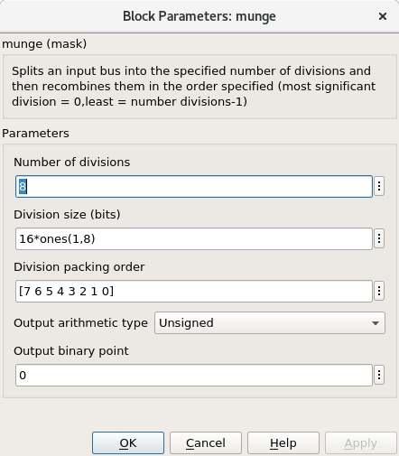
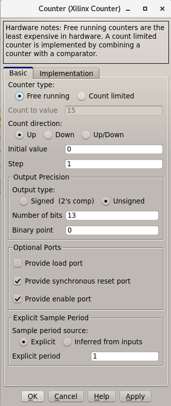
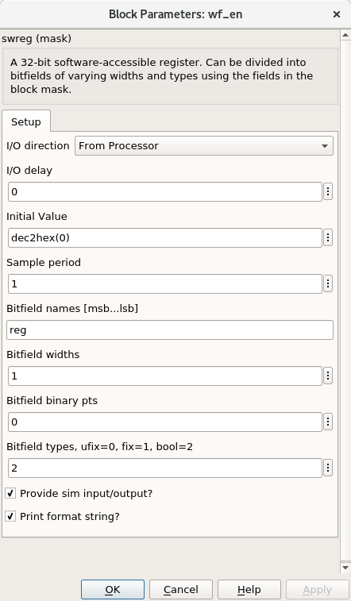

Tutorial 2.5: The RFDC DAC Interface
====================================

Introduction
------------
In the previous tutorial we introduced the RFDC Yellow block, with configurations
for the dual- and quad-tile RFSoCs with ADCs. It it worth providing a brief
introduction to the DAC interface. This tutorial assumes you have completed through
the RFDC tutorial :doc:`RFDC Interface <./tut_rfdc>`

The Example Design
--------------------
In this example we will configure the RFDC for a dual-tile RFSoC4x2 board.

This design will:
  * Set sample rates
  * Use the internal PLLs to generate the sample clock
  * Output a sinusoidal signal
  * Use the decimator
  * Use the coarse frequency mixer (NCO)

The final design will look like this for the RFSoC 4x2:

Section 1: Assembling & Configuring the pieces
^^^^^^^^^^^^^^^^^^^^^^^^^^^^^^^^^^^^^^^^^^^^^^

You'll need all these pieces
 * System Generator
 * RFSoC 4x2 block
 * RFDC
 * enable software register
 * bram
 * munge
 * counter

First, add your ``System Generator`` and ``RFSoC 4x2`` block. 

.. code:: bash

  # RFSoC4x2
  User IP Clock Rate: 245.76, RFPLL PL Clock Rate: 491.52

Add yout ``rfdc``
^^^^^^^^^^^^^^^^^
Double click on it, and disable all
available ADCs. Enable the first and second DAC tiles (228, 229), and only
enable the DAC 0 in either. Your ``Required AXI4-Stream Clock (MHz)`` should be 245.76
Configure the DAC tiles as follows:

.. code:: bash

  # Tile Config
  Sampling Rate   (MHz) - 1966.08
  Clock Out       (MHz) - 122.88
  Reference Clock (MHz) - 491.52
  Enable Tile PLLs      - True
  Output Power          - 20

  # DAC 0 Config
  Analog Output Data    - Real 
  Interpolation Mode    - 1x 
  Samples Per AXI Cycle - 8 
  Mixer Type            - Coarse
  Frequency             - 0
  Nyquist Zone          - Zone 1
  Decoder Mode          - SNR Optimized

  CHECK:
  Does your Required AXI4-Stream clock say 245.76?

Add your ``bram``
^^^^^^^^^^^^^^^^^
Connect the ``we`` port of the 
bram to a Xilinx 0 constant. Connect the ``data_in``
port to a Xilinx 0 constant. This will prevent the bram
from being loaded from the fabric, requiring us to load it with software.

.. code:: bash

  Output Data Type          - Unsigned
  Adress width              - 13
  Data Width                - 128
  Register Primitive Output - No
  Register Core Output      - No
  Optimization              - Minimum_Area
  Data Binary Point         - 0
  Initial Values (sim only) - Not important
  Sample rate               - 1

Add your ``munge``
^^^^^^^^^^^^^^^^^^
This block reorders the data from the ``bram``, so that the 
``rfdc`` can interpret it. ``din`` should connect to the ``bram``
``data_out``. ``dout`` should connect to both ``s00_axis_tdata`` and ``s10_axis_tdata``

.. code:: bash

  Number of divisions       - 8
  Division size (bits)      - 16*ones(1,8)
  Division packing order    - [7 6 5 4 3 2 1 0]
  Output arithmetic type    - Unsigned
  Output binary point       - 0

Add your ``Counter``
^^^^^^^^^^^^^^^^^^^^
Connect the output of this block to the ``bram``'s ``addr`` port.

This block will loop through all of the addresses in our bram, 
playing our signal on repeat. If you add separate control
logic, you can set a specific counter value, we don't need that level
of control to play a sine wave.

.. code:: bash

  Counter type              - Free running
  Count direction           - Up
  Initaial value            - 0
  Step                      - 1
  Output type               - Unsigned
  Number of bits            - 13
  Binary point              - 0
  Provide load port         - No
  Provide sync reset port   - Yes
  Provide enable port       - Yes
  Sample period source      - Explicit
  Sample rate               - 1

Add your ``Enable``
^^^^^^^^^^^^^^^^^^^^
Connect the output of this block to the ``Counter``'s ``en`` port.

This block enables the playing of our sine wave and looks really cool
while doing it.

.. code:: bash

  I/O direction             - From processor
  I/O delay                 - 0
  Initial Value             - dec2hex(0)
  Sample period             - 1
  Bitfield names [msb..lsb] - reg
  Bitfield widths           - 1
  Bitfield binary pts       - 0
  Bitfield types            - 2 (bool)

Section 2: Generating your signal
^^^^^^^^^^^^^^^^^^^^^^^^^^^^^^^^^

For this tutorial we will generate a sine wave in software. You can use 
the provided code, we would recommend that you add it to a file, which
you can run in ipython with ``run sine.py``

``sine.py``

.. code:: python

  import numpy as np
  import numpy.matlib
  import struct
  
  # bram parameters
  block_size = 128  # <bram data_width>
  bits_per_val = 16 # <rfdc input data size> 16 bits for rfsoc4x2
  blocks = 2**13    # 2**<bram address_width>
  num_vals = int(block_size / bits_per_val * blocks)
  
  # sine wave parameters
  fs = 1966.08e6      # Sampling frequency
  fc = 393.216e6      # Carrier frequency
  dt = 1/fs           # Time length between samples
  tau = dt * num_vals # Time length of bram 
  
  # Useful info if running as a script
  print(f"fs = {fs}")
  print(f"fc = {fc}")
  
  # Setup our array
  t = np.arange(0,tau,dt)
  
  # Generate our sine wave
  # frequency fc
  # range 0, 1
  x = 0.5*(1+np.cos(2*np.pi* fc *t))
  # scale our function to use the whole DAC range
  maxVal = 2**14-1
  x *= maxVal
  # set each value to a 16 bit integer, for DAC compatibility
  x = np.round(np.short(x))
  # Shift right, DAC is 14 bits
  x <<= 2

  # Save our array x as a set of bytes  
  buf = bytes()
  for i in x:
    buf += struct.pack('>h',i)

  # We're done!, we can now write buf to our
  # bram. To make sure it exists, enter len(buf)
  # in your ipython terminal

  # If needed we can save it as a file 
  # for later use, or transferability  
  f = open("sine.txt", "bw")
  f.write(buf)

Section 3: Sending your signal out
^^^^^^^^^^^^^^^^^^^^^^^^^^^^^^^^^^

1) Connect to and program your board normally
2) Configure your DAC timing as you did in tutorial 2
3) Generate your sine wave as shown above
4) Write your sine wave to your bram, and a 1 to your enable register

.. code:: python

  In [9]: rfsoc.listdev()
  Out[9]: 
  ['rfdc',
  'sys',
  'sys_board_id',
  'sys_clkcounter',
  'sys_rev',
  'sys_rev_rcs',
  'sys_scratchpad',
  'wf_bram_0',
  'wf_en']

  In [10]: rfsoc.write('wf_bram_0', buf)

  In [11]: rfsoc.write_int('wf_en', 1)

