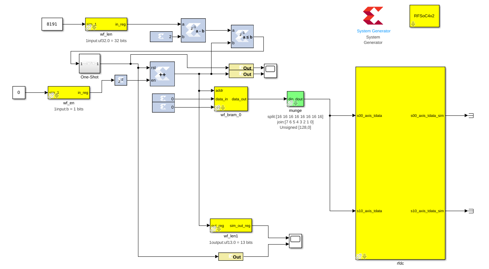

Tutorial 2.5: The RFDC DAC Interface
==================================

Introduction
-------------
In the previous tutorial we introduced the RFDC Yellow block, with configurations
for the dual- and quad-tile RFSoCs with ADCs. It it worth providing a brief
introduction to the DAC interface. This tutorial assumes you have completed through
the RFDC tutorial :doc:`RFDC Interface <./tut_rfdc>`

The Example Design
--------------------
In this example we will configure the RFDC for a dual-tile RFSoC4x2 board.

......
This design will:
  * Set sample rates
  * Use the internal PLLs to generate the sample clock
  * Output a sinusoidal signal
  * Use the decimator
  * Use the coarse frequency mixer (NCO)

The final design will look like this for the RFSoC 4x2:

Section 1: Assembling & Configuring the pieces
^^^^^^^^^^^^^^^^^^^^^^^^^^^^^^^^^^^^^^^^^^^^^^

You'll need all these pieces
 * System Generator
 * RFSoC 4x2 block
 * RFDC
 * dac_en software register
 * bram
 * munge

First, add your ``System Generator`` and ``RFSoC 4x2`` block. 

.. code:: bash

  # RFSoC4x2
  User IP Clock Rate: 245.76, RFPLL PL Clock Rate: 491.52

Add a ``rfdc`` block. Double click on it, and disable all
available ADCs. Only enable the first DAC tile (228), and only
enable the DAC 0. Your ``Required AXI4-Stream Clock (MHz)``
should be 245.76
Configure the DAC as follows:

.. code:: bash

  # Tile Config
  Sampling Rate   (MHz) - 1966.08
  Clock Out       (MHz) - 122.88
  Reference Clock (MHz) - 491.52
  Enable Tile PLLs      - True
  Output Power          - 20

  # DAC 0 Config
  Analog Output Data    - Real 
  Interpolation Mode    - 1x 
  Samples Per AXI Cycle - 8 
  Mixer Type            - Coarse
  Frequency             - 0
  Nyquist Zone          - Zone 1
  Decoder Mode          - SNR Optimized

  CHECK:
  Does your Required AXI4-Stream clock say 245.76?

Setup your ``bram`` to have a // *******************************************
Setup a counter to loop through your bram. The 

Section 2: Generating your signal
^^^^^^^^^^^^^^^^^^^^^^^^^^^^^^^^^

.. code:: python
import numpy as np
import numpy.matlib
import struct

block_size = 128  # <bram data_width>
   print("code")
   prange(0,tau,dt)
print('Expected ' + str(num_vals) + ' values. Got ' + str(len(t)))

x = 0.5*(1+np.cos(2*np.pi*(fc/fs*2000e6)*t))
maxVal = 2**13-1
x \*= maxVal
x = np.round(np.short(x))
x <<= 2
# print(x[0:2*round(repeats)])

buf = bytes()
for i in x:
  buf += struct.pack('>h',i)
print(len(buf))
print(buf[0:8])

f = open("sine.txt", "bw")
f.write(buf)rint("code")
bits_per_val = 16   # <rfdc input data size> 16 bits for rfsoc4x2 (closest to 14)
blocks = 2**13      # 2**<bram address_width>
num_vals = np.int32(block_size / bits_per_val * blocks) # numpy > 1.20

fs = 1966.08e6      # Sampling frequency
fc = 393.216e6      # Carrier frequency
dt = 1/fs           # Time length between samples
tau = dt * num_vals # Time length of bram 

print(f"fs = {fs}, fc = {fc}")
print(f"dt = {dt}, tau = {tau}")

Section 3: Sending your signal out
^^^^^^^^^^^^^^^^^^^^^^^^^^^^^^^^^^

In [1]: import casperfpga

In [2]: run sine.py
fs = 1966080000.0, fc = 393216000.0
dt = 5.086263020833334e-10, tau = 3.3333333333333335e-05
Expected 65536 values. Got 65536
131072
b'\x7f\xfcS\xc4\x0c8\x0c8'

In [3]: rfsoc = casperfpga.CasperFpga('192.168.2.140')

In [4]: rfsoc.listdev()
Out[4]: 
['rfdc',
 'sys',
 'sys_board_id',
 'sys_clkcounter',
 'sys_rev',
 'sys_rev_rcs',
 'sys_scratchpad',
 'wf_bram_0',
 'wf_bram_1',
 'wf_en',
 'wf_len',
 'wf_len1']

In [5]: rfsoc.upload_to_ram_and_program('rfsoc4x2_one_pps_2025-03-13_1656.fpg')
Out[5]: True

In [6]: rfsoc.listdev()
Out[6]: 
['rfdc',
 'sys',
 'sys_board_id',
 'sys_clkcounter',
 'sys_rev',
 'sys_rev_rcs',
 'sys_scratchpad',
 'wf_bram_0',
 'wf_bram_1',
 'wf_en',
 'wf_len',
 'wf_len1']

In [7]: rfsoc.adcs.rfdc.get_pll_config(1, rfsoc.adcs.rfdc.DAC_TILE)
Out[7]: 
{'Enabled': 1.0,
 'RefClkFreq': 491.52,
 'SampleRate': 1.96608,
 'RefClkDivider': 16.0,
 'FeedbackDivider': 4.0,
 'OutputDivider': 0.0}

In [8]: rfsoc.adcs.rfdc.status()
Out[8]: 
{'ADC0': {'Enabled': 1, 'State': 0, 'PLL': 1},
 'ADC1': {'Enabled': 0},
 'ADC2': {'Enabled': 0},
 'ADC3': {'Enabled': 0},
 'DAC0': {'Enabled': 1, 'State': 15, 'PLL': 1},
 'DAC1': {'Enabled': 1, 'State': 15, 'PLL': 1},
 'DAC2': {'Enabled': 1, 'State': 7, 'PLL': 0},
 'DAC3': {'Enabled': 0}}

In [9]: rfsoc.read_int('wf_len')
Out[9]: 8191

In [10]: rfsoc.write('wf_bram_0', buf)

In [11]: rfsoc.write_int('wf_en', 1)

